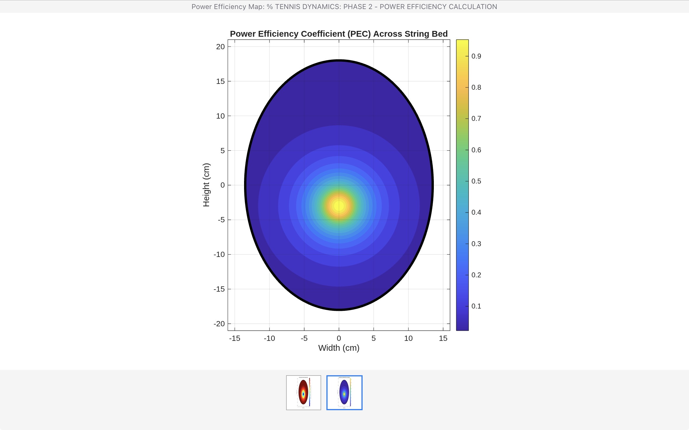

# Tennis-dynamics-analyzer-
A MATLAB-based structural dynamics diagnostic tool for mapping racket power efficiency and vibrational shock transmission.
# Tennis Dynamics Analyzer

A diagnostic suite built in MATLAB to quantify the performance of tennis racket frames through structural dynamics mapping.

## Overview
This project visualizes the performance characteristics of a tennis racket by mapping two critical metrics:
1. **Power Efficiency Coefficient (PEC):** Identifies the "sweet spot" for maximum ball exit velocity.
2. **Vibrational Shock Transmission:** Maps the areas of highest structural vibration to assist in injury prevention and mass distribution optimization (lead tape placement).

## Methodology
- **Geometry:** Modeled as an elliptical elastic membrane with offset sweet spot constraints.
- **Physics:** Calculated energy transfer using inverse-square decay models to determine effective mass at impact points.
- **Diagnostics:** Utilized structural flex functions to calculate frame torsion and vibration intensity.

## Visualizations

## Usage
Run `racket_analyzer.m` in MATLAB. The script generates a spatial grid, applies boundary conditions, and renders heatmaps for both power output and shock transmission.
